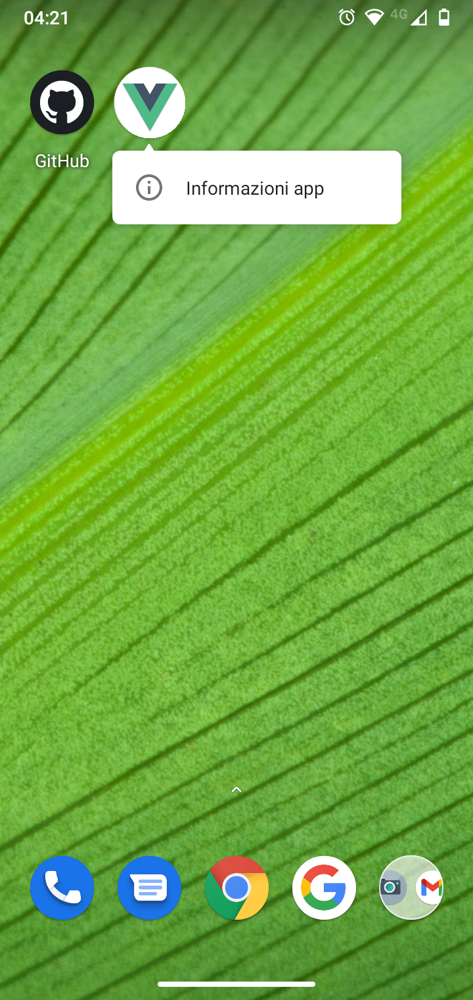
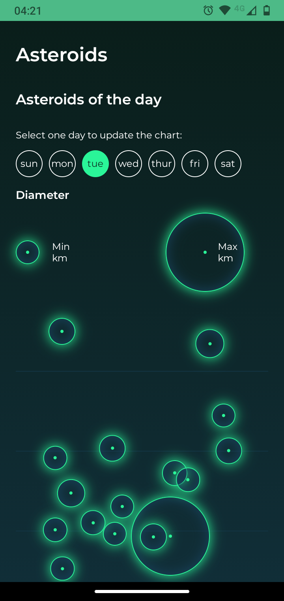
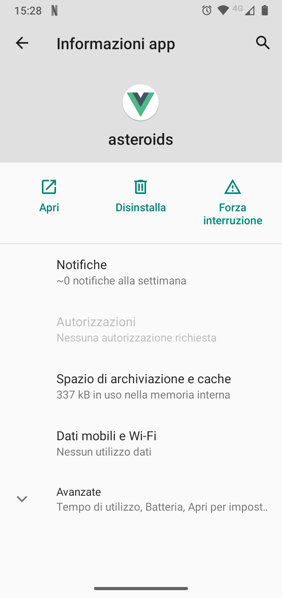

# asteroids

A [Vue.js](https://vuejs.org) applications of [NASA's API](https://api.nasa.gov).







## Environments

|branch|uri|
|-|-|
|develop|https://asteroids-nasa-develop.herokuapp.com/|
|master|https://asteroids-nasa.herokuapp.com/|

## Stack

- [Node.js](https://nodejs.org/en/)
- [npm](https://www.npmjs.com)
- [Vue CLI](https://cli.vuejs.org/)
- [Git](https://git-scm.com/)

## Getting started
```shell
git clone https://github.com/mattiapontonio/asteroids.git
cd asteroids
npm i
npm run build
export PORT=<port>
export API_KEY=<key>
npm start
```

## Scripts
```shell
npm run
```

### API
https://api.nasa.gov/
